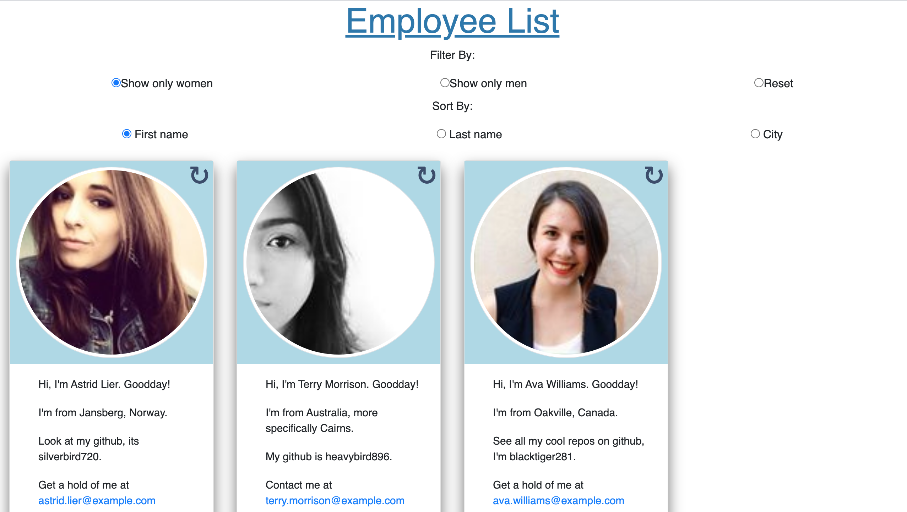

# employee-directory
An employee directory with randomly generated employees.

## Table of Contents
1. [ Description ](#desc)
2. [ Visuals ](#visuals)
3. [ Deployed Webpage ](#deployed)
4. [ Support ](#support)
5. [ Authors and Acknowledgement ](#acknowledge)
6. [ Next Steps ](#next)
7. [ License ](#license)

## 1. Description
Automatically generates a list of random employees. Lets you filter or sort these employees by different categories.

### Summary of functionality
- The user can 'regenerate' an employee and get a new one.
- The user can filter employees by gender.
    - After the employee is filtered, the regenerate button will only produce 'matching' employees.
- The user can sort employees, by first or last name or by city.
- Every employee has a unique way of giving their info.

## 2. Visuals
Screenshot:

To come!

## 4. Support
Should you find an issue with this webpage, please create a [new issue](https://github.com/Tasha876/employee-directory/issues/new/choose) on my GitHub repository.

## 5. Authors and Acknowledgement
The code in this project was created by Natasha Fray. The idea is from the instructors at the [U of T Coding Bootcamp](https://bootcamp.learn.utoronto.ca/)

## 6. Next Steps
This app could benefit from better UI.

## 7. License
This project is covered by the [MIT](license) license.

